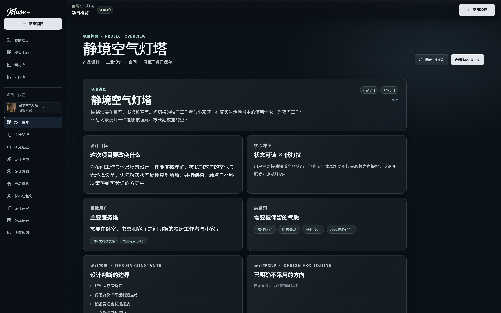
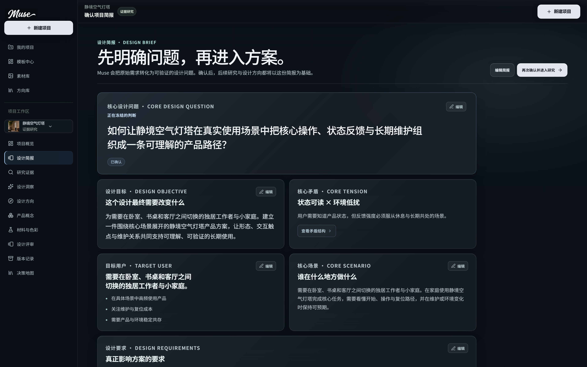
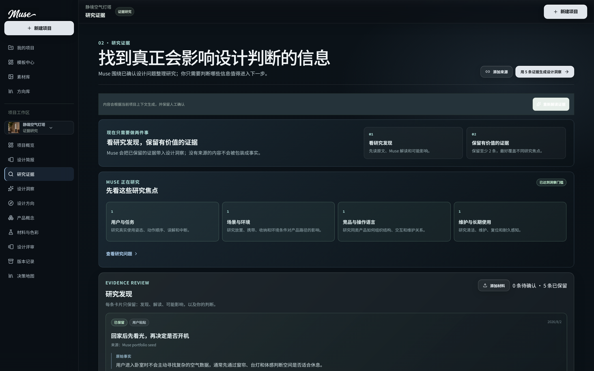
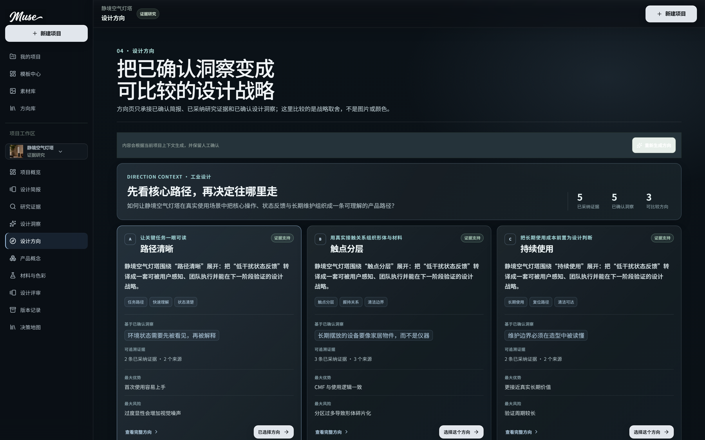

# Muse AI

[](https://github.com/3555489035ppx-wq/muse-ai-workspace/actions/workflows/quality.yml)

Muse 是一个面向产品设计师的 AI 创意决策工作台（AI-powered creative decision workspace）。它把模糊的早期需求推进成一条可以回看、比较和继续验证的设计链，而不是只生成一张孤立的效果图。

> 这是一个可运行的 Muse MVP。默认不需要外部密钥即可浏览已保存案例、理解产品流程并运行离线状态；需要真实模型时，用户可以在设置页连接自己的 Provider（模型服务商）。

## 产品概览

Muse 面向产品设计学生、工业设计师和早期产品团队，解决早期创意工作中的三个断点：

- 需求停留在一段模糊描述，无法形成可确认的设计问题；
- 研究、洞察、方向和概念之间缺少上下游关系；
- 方案有了之后，团队难以解释为什么选择它、放弃了什么，以及下一步如何验证。

核心工作链：

```text
需求理解 → 设计简报 → 研究证据 → 设计洞察 → 方向比较 → 概念探索 → 材料与色彩 → 设计评审 → 版本与决策地图
```

Muse 的价值在于让 AI 的每一步输出都成为下一步判断的上下文，同时把人的确认、编辑、排除和锁定保留在流程里。

## Featured demo：谷仓鲜度轨

“谷仓鲜度轨”是本仓库用于演示的主案例：一个模块化厨房收纳产品。打开项目后，可以沿着完整工作链查看：

1. 项目目标、用户和核心场景；
2. 研究证据与设计洞察；
3. 三个可比较的设计方向；
4. 当前方向下的产品概念、CMF 和评审；
5. 版本记录以及“证据 → 选择 → 方案”的决策关系。

同时保留三个并行演示项目：

| 项目 | 产品类型 | 用途 |
| --- | --- | --- |
| 净安宝 | 便携式多功能消毒器 | 展示单手照护、移动工具与耐用设备的方向取舍 |
| 静境空气灯塔 | 家居环境设备 | 展示状态反馈、长期维护与低干扰场景 |
| 回收餐厨器 | 家庭循环设备 | 展示清洁边界、结构分区与循环使用路径 |
| 谷仓鲜度轨 | 模块化厨房收纳 | Featured demo，展示完整决策闭环 |

四个项目共享同一套 `projectId` 隔离、证据关系和阶段约束；项目素材位于 [`public/assets`](public/assets) 与 [`public/portfolio`](public/portfolio)，注册表见 [`docs/demo-project-registry.md`](docs/demo-project-registry.md)。

## AI 与人的关系

Muse 不是把设计师替换成聊天框。每次 AI 参与都遵循以下边界：

- **Input（输入）**：项目名称、目标、目标用户、场景、交付物、约束和关键词；
- **Context（上下文）**：已确认的 Brief、研究证据、洞察、选定方向和上游资产；
- **Processing（处理）**：结构化输入、归纳证据、识别模式、提出差异化方向并检查上下游关系；
- **Output（输出）**：可编辑的简报、洞察、方向、概念、CMF、评审意见和版本变更说明；
- **Interaction（交互）**：设计师可以确认、编辑、排除、锁定、重试或回到上游修改；
- **Persistence（保存）**：项目、来源、资产、运行状态和版本记录保存在浏览器数据库或受控服务端运行目录；
- **Next step（下一步）**：每个结果都明确进入下一个阶段的条件，最终汇入版本记录和决策地图。

图片生成只有在概念被用户确认后才会进入，生成资产会记录来源、模型和上游 Prompt 版本。没有连接真实 Provider 时，界面会保持离线状态，不把本地结果标成实时模型输出。

## 主要能力

- 黑色编辑型工作台与响应式项目导航；
- 从项目输入到 Brief、研究、洞察、方向、概念、CMF、评审和版本的连续流程；
- 证据、洞察、方向、概念和版本之间的可追溯关系；
- 设计方向比较、锁定和后续视觉探索；
- 浏览器本地持久化、回收站、资产库和决策地图；
- 设置页连接 Text AI 与 Image AI，支持用户自带 API Key（BYOK）；
- 本地 Node BFF 与同源 Sites Worker 两种真实 AI 运行边界；
- 针对数据隔离、Provider 连接、预算、图片校验和 Sites 构建的自动化测试。

## 产品截图











更多阶段截图见 [`docs/screenshots`](docs/screenshots)。

## 技术栈

- React 19 + React Router 7
- Vite 6 + TypeScript 6
- Dexie / IndexedDB：浏览器端项目与资产持久化
- Zustand、Immer、Zod：状态、不可变更新与边界校验
- Node.js BFF：Provider 适配、预算、幂等、密钥存储和资产校验
- Sites Worker：线上同源 `/api` 与 BYOK 加密会话
- pnpm：依赖安装与脚本执行

架构说明见 [`docs/architecture.md`](docs/architecture.md)。

## 快速开始

要求：Node.js 22+ 与 pnpm 10+。

```bash
corepack enable
pnpm install
pnpm dev
```

然后打开 `http://localhost:5175`。`pnpm dev` 会同时启动 Vite 前端和本地 BFF；没有配置 Provider 时，仍可浏览四个项目和已保存流程。

常用命令：

```bash
pnpm typecheck   # TypeScript 项目检查
pnpm lint        # ESLint
pnpm test        # 全量单元与领域回归
pnpm test:sites  # Worker / SPA fallback / BYOK 接口测试
pnpm build       # 生产前端、Node 构建与 Sites 构建
pnpm start       # 运行 dist/client + /api 的单进程入口
```

## 连接真实 AI

### 方式一：用户在设置页输入自己的 Key

进入 `设置 → AI 服务 / API`，分别配置 Text AI 与 Image AI，填写 Provider、Base URL、模型 ID 和 API Key，然后先测试连接，再保存。Key 不会写入 LocalStorage、项目 JSON、URL 或普通运行记录。

### 方式二：服务端默认配置

```bash
Copy-Item .env.example .env
```

只在服务端 `.env` 中填写密钥：

```env
DEEPSEEK_API_KEY=
OPENAI_API_KEY=
MUSE_AI_LIVE_ENABLED=true
MUSE_AI_KILL_SWITCH=false
MUSE_AI_ALLOWED_PROJECT_IDS=
```

不要使用 `VITE_` 前缀保存供应商密钥，也不要把 `.env` 提交到 GitHub。线上 BYOK、加密会话和 Provider API 说明见 [`docs/REAL_AI_SETUP.md`](docs/REAL_AI_SETUP.md)。

### 线上边界

纯静态托管只能展示前端和已保存案例，不能安全地代理真实 AI。要支持上线后用户输入 Key，需要部署本仓库的 Worker，或把 `server/` BFF 迁移为受控的 Node/Vercel Functions，并配置密钥加密、鉴权、限流、预算与运行数据持久化。

## 当前状态与限制

当前版本是可运行 MVP：四个演示项目、端到端工作链、真实 AI BFF、线上 BYOK Worker、自动化回归和部署构建均已纳入仓库。

仍需在正式商业化前补齐：

- 用户身份、团队空间与跨设备同步；
- 线上密钥的账户级托管、轮换和审计；
- 更完整的限流、计费、监控和告警；
- 真实用户研究与模型质量评估数据；
- 面向 Vercel 的 `/api` Functions 适配。

这些限制是产品边界，不会在没有配套基础设施时写成已经解决。

## 后续 Vercel 部署

推荐先把本仓库作为 GitHub 源码入口，再根据部署目标选择：

1. **静态演示**：Vercel 使用 `pnpm build` 构建前端，关闭真实生成，仅展示产品与已保存案例；
2. **真实 AI 演示**：保留当前前端和数据模型，将 `server/` 的 `/api` 端点迁移为 Vercel Functions，配置加密密钥、鉴权、限流、预算和 Provider 环境变量；
3. **受控原型环境**：继续使用同源 Worker 或 Node BFF，让用户在设置页输入自己的 Key，并限制项目范围与费用上限。

仓库暂不添加未经验证的 Vercel 配置，以免把部署能力写成未经过运行验证的承诺。

## 项目结构

```text
src/
  features/                 页面与交互
  data/                     四个项目与工作流种子
  db/                       IndexedDB、迁移与种子逻辑
  lib/ai/                   AI 输入、Prompt 与 Provider 客户端
  infrastructure/providers/ 本地确定性适配器与远程 BFF 适配器
server/                     Node BFF、预算、密钥和资产策略
worker/                     Sites Worker 与线上同源 API
public/                     产品素材、项目视觉与流程截图
tests/                      领域、BFF、Worker、工业设计流程回归
docs/                       架构、AI 接入、案例注册表和截图
```

## 项目演示建议

推荐演示顺序：先说明“早期创意为什么难以决策”，再打开“谷仓鲜度轨”展示证据如何进入方向比较，最后回到决策地图说明 Muse 如何保留人的判断。需要展示真实模型时，再在设置页连接自己的 Provider，并明确当前模型、费用与失败状态。

## 作者与许可

作者：Ppx15 · Muse AI 产品设计项目。

本仓库当前未附带 MIT 或其他开源许可证。代码、字体、图片和第三方依赖的使用边界请先阅读 [`OPEN_SOURCE_NOTICES.md`](OPEN_SOURCE_NOTICES.md) 与 [`THIRD_PARTY_NOTICES.md`](THIRD_PARTY_NOTICES.md)；如需公开复用，请先取得相应授权。
