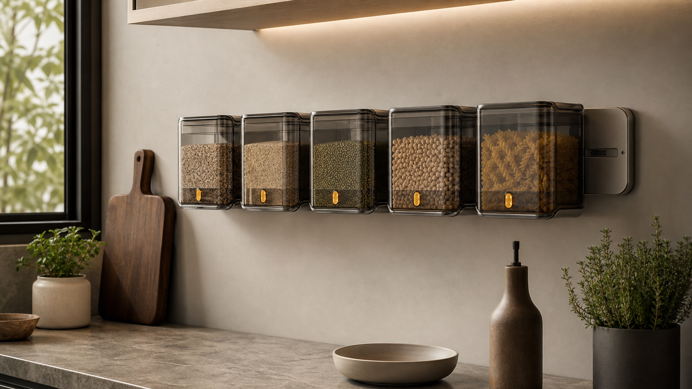
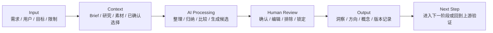
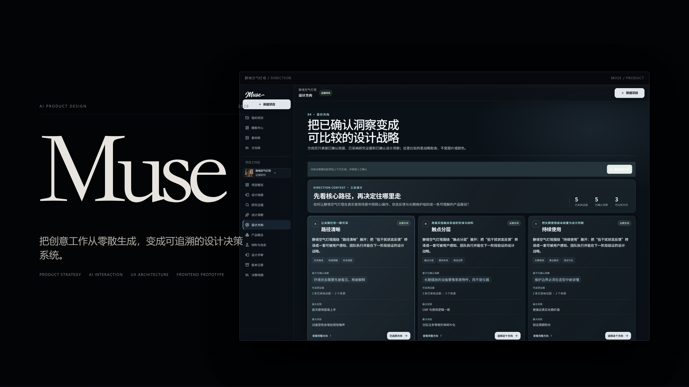
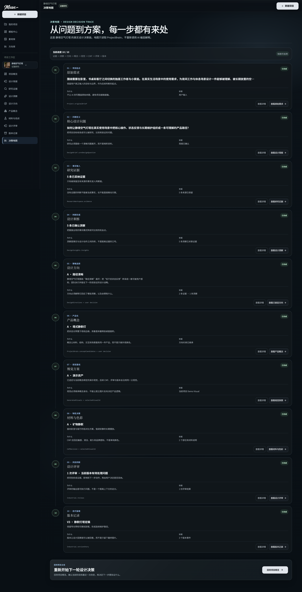

# Muse AI Workspace

> AI Creative Decision Workspace for product designers.

Muse helps designers turn an ambiguous brief into a traceable chain of research, insights, directions, concepts, review, and version decisions. The product is designed around a workspace, not a one-off chatbot answer.

[Live Demo](https://muse-ai-workspace.vercel.app/) · [GitHub](https://github.com/3555489035ppx-wq/muse-ai-workspace)



## Live Demo

- 公开网址：<https://muse-ai-workspace.vercel.app/>

## Project Background

In the early stage of product design, a brief, research notes, visual references, and AI outputs often live in different tools. The result is a large amount of exploration but very little decision continuity:

- the original problem becomes difficult to recover;
- research does not clearly influence the chosen direction;
- AI output is hard to compare or explain later;
- the reasoning behind a version disappears when the project moves forward.

Muse was created to make the decision chain itself a first-class product surface.

## User Problem

**Target users**

- Product design students
- Industrial designers
- Early-stage product teams

**Core problems**

1. Ambiguous requests are difficult to translate into a design problem.
2. Research and concept exploration have no reliable bridge.
3. Generated options lack criteria for comparison.
4. Decisions, rejected directions, and next validation steps are easy to lose.

## Product Goal

Make AI a design decision assistant rather than an answer generator. Muse supports the chain:

```text
Brief understanding → Research evidence → Design insight → Direction comparison → Concept exploration → Review and version decision
```

The user keeps the authority to confirm, edit, reject, lock, retry, or return to an upstream step.

## My Design Decisions

### Why not use a chatbot as the main interface?

Design work is not a single question followed by a single answer. It accumulates context, compares alternatives, and revisits earlier assumptions. A chat-only surface hides those relationships, so Muse uses a workspace structure where the current stage, evidence, outputs, and next step remain visible together.

### Why make the decision chain visible?

The value of AI is not only speed. For a product project, the important question is whether a designer can explain why a direction was chosen. Every meaningful result therefore keeps its source, upstream relationship, confidence, limitation, and next validation step.

### Why feature one complete case?

The product contains several seeded cases for regression coverage, but the public experience now leads with one complete story: **谷仓鲜度轨**. This reduces choice overload and lets a visitor understand the full workflow in under three minutes. The other seeded cases remain in code and tests; they are hidden from the default product path rather than deleted.

## AI Workflow



**Human-in-the-loop（人在回路）** is part of the core flow. When a provider is unavailable, Muse keeps the offline demo state explicit; it does not label local demo assets as live model output.

## Demo

The recommended 3-minute path is:

1. Open the [Live Demo](https://muse-ai-workspace.vercel.app/).
2. Click **谷仓鲜度轨 Demo** on the homepage and review the confirmed project brief.
3. Follow research evidence into design insights, then compare directions.
4. Open the selected concept, CMF, review, and version states.
5. Finish at the decision map to see how evidence became a product choice.

The live demo is a working MVP. It can be explored without an external API key; real text/image providers can be connected through the product's BYOK settings when a controlled AI run is needed.

## Product Screens





The curated product screenshots are indexed in [`docs/screenshots`](docs/screenshots). Development captures and test artifacts are not used as the primary README visuals.

## Technical Implementation

- React 19, React Router 7, Vite, and TypeScript
- Dexie / IndexedDB for local-first projects, assets, and versions
- Zustand, Immer, and Zod for state and boundary validation
- Node BFF and Sites Worker boundaries for provider calls, budgets, BYOK, and asset validation
- Deterministic demo visual provider with project-level traceability
- Unit, workflow, BFF, Worker, and industrial design regression tests

## Project Documents

- [Case Study](docs/case-study.md)
- [Product Story](docs/product-story.md)
- [User Flow](docs/user-flow.md)
- [Design Decisions](docs/design-decision.md)
- [Demo Script](docs/demo-script.md)
- [Architecture](docs/architecture.md)
- [Real AI Setup](docs/REAL_AI_SETUP.md)

## Current Boundary

This repository is a runnable product MVP, not a claim of production-scale collaboration. Identity, team workspaces, cross-device sync, billing, monitoring, and formal user research remain future work. The README keeps those boundaries visible so that AI capability is not overstated.

## Local Development

Requires Node.js 22+ and pnpm 10+.

```bash
corepack enable
pnpm install
pnpm dev
```

After the local server starts, use the development URL printed by Vite. Common checks:

```bash
pnpm typecheck
pnpm lint
pnpm test
pnpm test:industrial
pnpm build
```

## License and Asset Boundary

This repository does not currently declare an open-source license. Before reusing the code, read [`OPEN_SOURCE_NOTICES.md`](OPEN_SOURCE_NOTICES.md) and [`THIRD_PARTY_NOTICES.md`](THIRD_PARTY_NOTICES.md), and confirm the rights for fonts, images, and dependencies.
