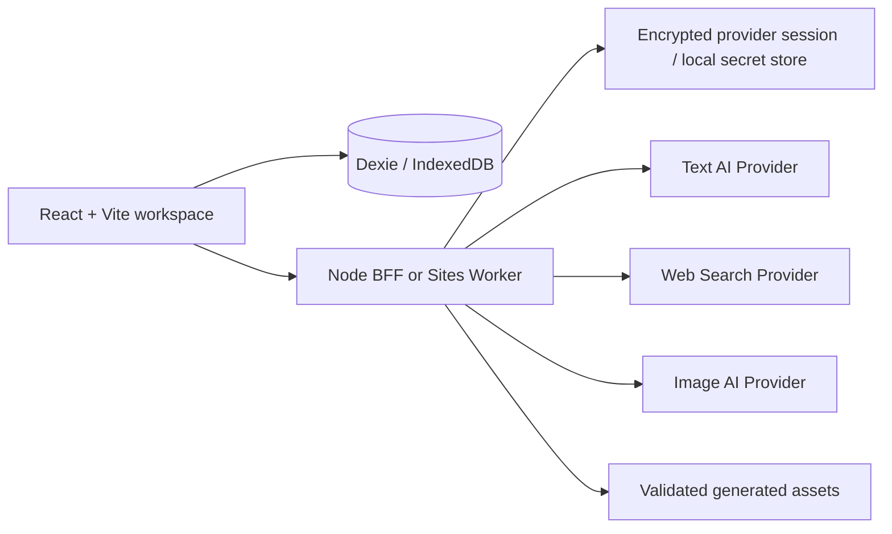

# Muse AI architecture

Muse 把设计判断拆成一条有上下游关系的工作链。前端负责让设计师确认和修改每一步，AI 负责在当前上下文中整理与扩展，持久化层负责保留来源、状态和版本。

## Runtime topology



## Frontend

- `src/features/` contains the landing page, project entry, settings, workflow stages and library views.
- `src/db/` owns browser persistence, migrations and the four curated project seeds.
- `src/lib/ai/` builds stage-specific input from the current project context and calls the BFF client.
- The UI keeps human checkpoints: confirm Brief, accept evidence, select insights, lock one direction, choose a concept, review and create a version.

## AI boundary

Every AI stage follows the same contract:

1. **Input** — the current user-edited record and the stage action;
2. **Context** — confirmed upstream records and traceable source IDs;
3. **Processing** — provider-specific structured generation or image generation;
4. **Output** — a validated record with provenance and a next-stage reference;
5. **Interaction** — confirm, edit, reject, retry or continue;
6. **State** — idle, running, ready, partial, failed or unavailable;
7. **Persistence** — the result, provider metadata and upstream IDs are saved;
8. **Next step** — downstream stages can only read the approved upstream state.

The browser never calls a provider with a server-owned secret. Local development uses the Node BFF. The Sites build exposes the same-origin `/api` boundary through `worker/index.js`.

## Local and online modes

### Offline review mode

The repository ships curated portfolio seeds and deterministic local adapters so a reviewer can inspect the full product flow without a provider account. These records are project-bound and remain visibly separate from live provider results.

### Real AI mode

Text, search and image requests are sent from the BFF to server-managed providers. The BFF applies provider configuration, project allow-listing, request budgets, idempotency, response validation and failure preservation before returning a result to the browser. Search responses retain URL, publisher, date, snippet and content-status provenance; they are candidates until a user opens the original source and accepts the excerpt.

### BYOK online mode

On the Worker runtime, a user-entered provider key is encrypted into a browser-scoped HttpOnly session cookie. The full key is not returned to React and is not written into LocalStorage, exported project JSON, URLs or normal run metadata. There is no account system in this MVP, so the configuration is recoverable only from the same browser.

## Data relationships

```text
Project
  └─ Original brief → Design brief
       └─ Research workspace → Design insights
            └─ Locked direction → Concept candidates
                 └─ Selected concept → CMF / generation assets
                      └─ Review → Version → Decision map
```

The `projectId` is carried through every demo record and visual asset. Direction records can only use the current project's confirmed insights; concepts are scoped to the selected direction; CMF and review records reference the selected concept and its asset lineage.

## Deployment notes

- `pnpm build` produces the Vite client, server bundle preparation and Sites build output.
- `pnpm start` serves `dist/client` and `/api` from one Node process for controlled environments.
- GitHub Pages and other static hosts can show the product but cannot safely proxy provider requests.
- Vercel uses the same Worker implementation through `api/_muse-adapter.ts`; configure `MUSE_SITE_TEXT_*` and (for P1 research search) `MUSE_SITE_SEARCH_API_KEY` as server-side environment variables.

The current system intentionally does not add a deployment-specific adapter before it has been verified in that target runtime.
