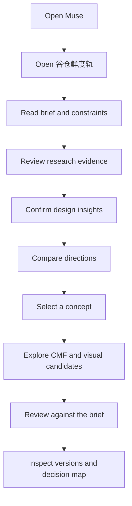

# Muse User Flow

## Recommended user flow

## Stage contract

| Stage | User sees | User decides | Next step |
| --- | --- | --- | --- |
| Brief | goals, users, scenarios, constraints | confirm or edit the problem framing | research |
| Research | sources, observations, evidence limits | keep, edit, or reject evidence | insight |
| Insight | patterns and opportunity statements | confirm the useful interpretation | direction |
| Direction | comparable strategies and trade-offs | select, combine, or reject | concept |
| Concept / CMF | concept candidates and material choices | choose the candidate to review | review |
| Review | criteria, risks, and validation work | accept the result or create a new version | version |

## Failure and fallback states

- Provider unavailable: keep the local demo state and show a clear boundary.
- Insufficient evidence: ask the user to add or edit context before generating downstream content.
- Candidate rejected: preserve the rejection reason and return to direction comparison.
- Asset missing: keep the text decision and show a project-scoped missing-asset state; never substitute another project's image.
